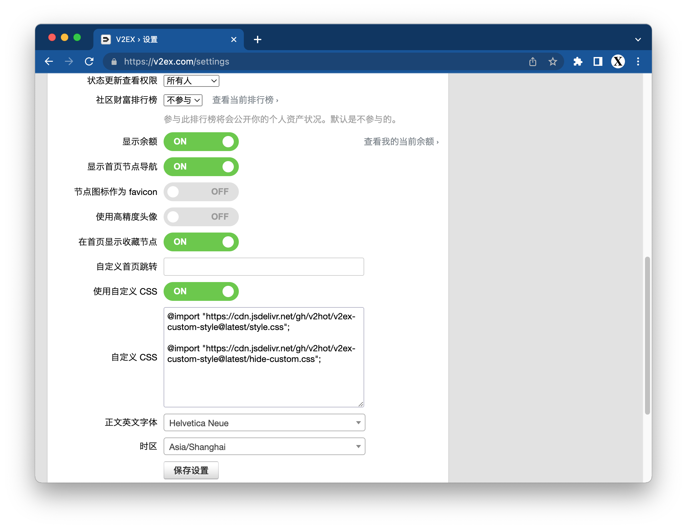
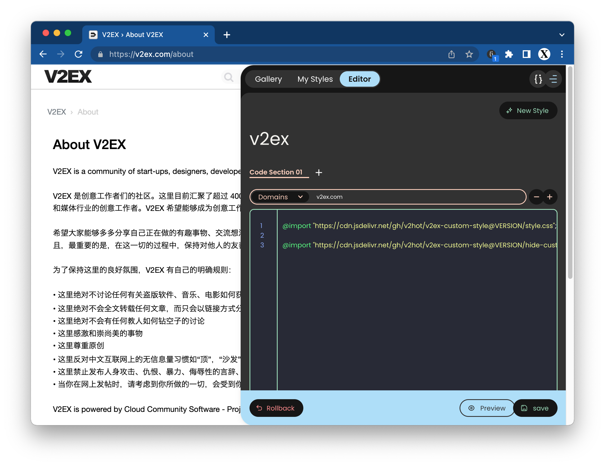

# v2ex-custom-style

V2EX 自定义样式 🌈

## Usage

把下面 CSS 代码，放到 [**v2ex > 设置 > 自定义 CSS**](https://www.v2ex.com/settings) 或 [**stylish**](https://chrome.google.com/webstore/detail/stylish-custom-themes-for/fjnbnpbmkenffdnngjfgmeleoegfcffe) 里面即可。




⚠️ 注意：下面 URL 的 `VERSION` 要改成最新或指定的[版本](https://github.com/v2hot/v2ex-custom-style/releases)。

例如：`latest`, `1.0.0`, `1.0.1` 等。

### 按需加载 CSS 文件

#### 节点显示增强

```css
@import "https://cdn.jsdelivr.net/gh/v2hot/v2ex-custom-style@VERSION/enhance-node-name.css";
```

#### 隐藏头像

```css
@import "https://cdn.jsdelivr.net/gh/v2hot/v2ex-custom-style@VERSION/hide-profile-photo.css";
```

#### 导航栏固定在顶端

```css
@import "https://cdn.jsdelivr.net/gh/v2hot/v2ex-custom-style@VERSION/sticky-header.css";
```

#### 隐藏广告

```css
@import "https://cdn.jsdelivr.net/gh/v2hot/v2ex-custom-style@VERSION/no-ads.css";
```

#### 极简风格

```css
@import "https://cdn.jsdelivr.net/gh/v2hot/v2ex-custom-style@VERSION/minimalist.css";
```

### 加载全部

加载上面全部 CSS

```css
@import "https://cdn.jsdelivr.net/gh/v2hot/v2ex-custom-style@VERSION/style.css";
```

### 其他

#### 自定义隐藏

请 fork 代码，按自己需要修改。

或把 CSS 代码直接写在 **v2ex > 设置 > 自定义 CSS** 或 **stylish** 里面。

```css
@import "https://cdn.jsdelivr.net/gh/v2hot/v2ex-custom-style@VERSION/hide-custom.css";
```
